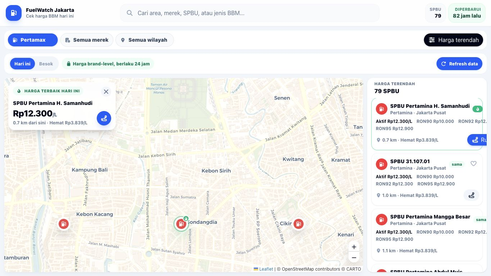

# FuelWatch Jakarta

Aplikasi pencari SPBU dan harga BBM Jakarta berbasis Vue 3, TypeScript, Leaflet, dan backend Go. UI terinspirasi FuelWatch WA: peta, daftar harga terendah, filter cepat, GPS distance, dan refresh harga.



## Fitur

- Peta SPBU Jakarta dengan marker brand dan cluster warna dinamis.
- Fokus awal peta ke area dengan kepadatan SPBU tertinggi.
- Filter jenis BBM, merek, wilayah, pencarian, dan sort harga/jarak.
- GPS untuk menghitung jarak terdekat.
- Validasi lokasi di luar jangkauan Jakarta.
- Tooltip marker berisi nama SPBU, brand, RON92, jarak, hemat Rp/L, dan tombol rute.
- Data harga otomatis di-fetch saat app dibuka.
- Tombol `Refresh data` untuk trigger scrape terbaru, lengkap dengan loader dan toast sukses/gagal.
- Empty state dan reset filter.
- Responsive desktop/mobile.

## Data

- Lokasi SPBU berasal dari `SPBU_DKI_Jakarta.csv`, diolah ke `src/data/stations.ts`.
- Harga fallback frontend ada di `src/data/stations.ts`.
- Cache harga backend ada di `backend/data/fuel_prices.json`.
- Saat backend aktif, frontend mengambil harga dari `GET /api/v1/prices`.
- Refresh manual memakai `POST /api/v1/scrape`.

Sumber harga yang digunakan:
- Pertamina Patra Niaga / MyPertamina
- Shell Indonesia
- BP Indonesia
- Vivo Energy Indonesia / rilis resmi yang terverifikasi

## Tech Stack

- Vue 3
- TypeScript
- Vite
- Tailwind CSS
- Leaflet
- Go backend scraper

## Struktur

```text
src/
├── components/
│   ├── Header.vue
│   ├── FilterBar.vue
│   ├── Map.vue
│   └── StationList.vue
├── data/
│   └── stations.ts
├── services/
│   └── prices.ts
├── types/
│   └── index.ts
├── App.vue
├── main.ts
└── style.css

backend/
├── cmd/server/main.go
├── data/fuel_prices.json
└── internal/
```

## Setup

```bash
npm install
npm run dev
```

Frontend: `http://localhost:5173`

## Backend

```bash
cd backend
go run ./cmd/server
```

Backend: `http://localhost:8080`

Endpoints:

- `GET /health`
- `GET /api/v1/prices`
- `POST /api/v1/scrape`

## Build

```bash
npm run build
npm run preview
```

## Env

Frontend dapat diarahkan ke backend lain:

```bash
VITE_API_BASE_URL=http://127.0.0.1:8080
```

Backend config lebih lengkap ada di `backend/README.md`.

## Catatan

Koordinat SPBU dari CSV belum semuanya geocoded presisi. Link Google Maps tetap dipakai untuk navigasi.
